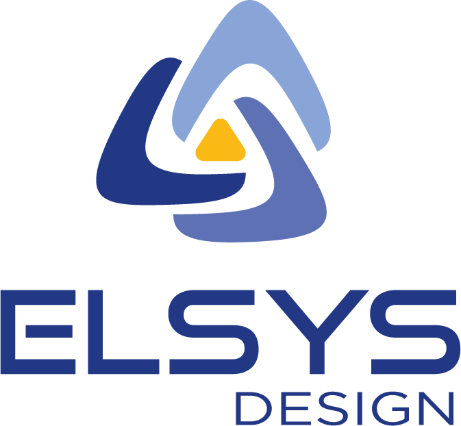

# Hi there 👋

I'm a Embedded Software Technical Leader at [ELSYS Design](https://www.elsys-design.com/fr)

  

## Statistics 🎉

  
  
  

## What you can find from here

In my repositories, you will find examples and courses on embedded subjects.

